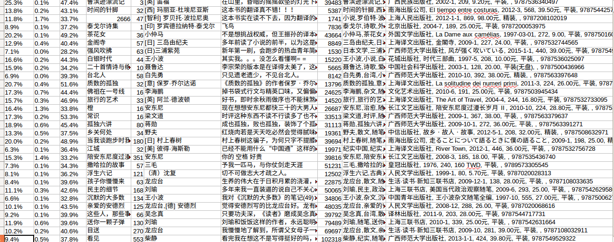
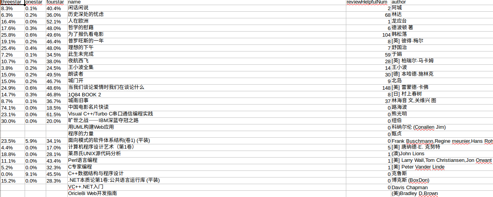
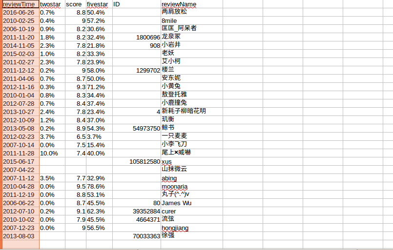
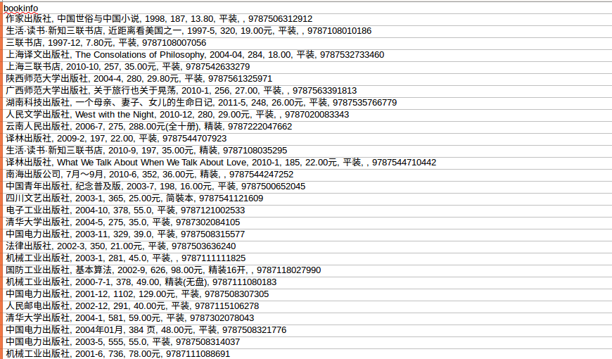

# 介绍

这个工程抓取了豆瓣一些流行书籍，它包括书的书名、作者、书的相关信息、豆瓣评分以及关于书籍的评论等等。具体的信息请参考[items.py](https://github.com/hanxlinsist/crawl_web/blob/master/douban/douban/items.py). 

# 抓取过程简介

1. 抽取豆瓣书籍[Tag页面](https://book.douban.com/tag/)的所有Tag链接。
2. 把对应Tag书籍按评价排序。
3. 抽取前10页的所有书籍。

由于抓取需要很多的时间，我只抽取每个Tag对应的前10页最受欢迎的书籍。抓取这些内容，我的电脑将近跑了两天。一共抓取了18474条数据。如果你想抓取更多的数据，只需修改一点代码就可以抓取你自己想要的内容了。

# 抓取内容部分截图







# 运行爬虫

    git clone https://github.com/hanxlinsist/crawl_web
    cd crawl_web/douban
    scrapy crawl book.douban -o books.csv -t csv
    
我的系统版本是ubuntu 14.04 LTS，如果你是Windows用户，你只需要下载工程的Zip包，进入到crawl_web/douban目录，运行上面的第3条命令就行了。前提是你已经安装了相应的包。

# 高级设置

1. 用代理IP抓取网页
   - 打开这[三行](https://github.com/hanxlinsist/crawl_web/blob/master/douban/douban/settings.py#L27)注释。
   - 把这个[代理列表](https://github.com/hanxlinsist/crawl_web/blob/master/douban/douban/settings.py#L34)路径修改成你自己的路径。
2. 修改request header的User Agent
   - 修改[UserAgents.py](https://github.com/hanxlinsist/crawl_web/blob/master/douban/douban/UserAgents.py)
3. 启用AutoThrottle extension（extension说明：这个扩展会自动节流抓取网站的速度，基于Scrapy server和你要抓取网站的负载）
   - 去掉[这行](https://github.com/hanxlinsist/crawl_web/blob/master/douban/douban/settings.py#L49)的注释
   - 把AUTOTHROTTLE_ENABLED设置为True
4. 定制每个spider的经过的pipeline
   - 在[pipelines.py](https://github.com/hanxlinsist/crawl_web/blob/master/douban/douban/pipelines.py)中定义自己要使用的pipelines
   - 在process_item方法上面加上@check_spider_pipeline
   - 在自己的spider中加入[pipeline属性](https://github.com/hanxlinsist/crawl_web/blob/master/douban/douban/spiders/BookSpider.py#L17)

# 测试spider

为了以后开发相应的功能方便，我写了一个测试[spider](https://github.com/hanxlinsist/crawl_web/blob/master/douban/douban/spiders/TestSpider.py),这个spider只抓取一本图书，你可以用命令行传递你想要抓取的图书ID. 比如，我要抓取图书的网址为'https://book.douban.com/subject/1082154/'，那么其中的数字就是图书的ID. 

运行测试spider的命令如下：

    scrapy crawl douban.test -o test.csv -t csv -a bookid=你想要抓取图书的ID 


# spiders运行原理

1. You start by generating the initial Requests to crawl the first URLs, and specify a callback function to be called with the response downloaded from those requests.The first requests to perform are obtained by calling the start_requests() method which (by default) generates Request for the URLs specified in the start_urls and the parse method as callback function for the Requests.
2. In the callback function, you parse the response (web page) and return either dicts with extracted data, Item objects, Request objects, or an iterable of these objects. Those Requests will also contain a callback (maybe the same) and will then be downloaded by Scrapy and then their response handled by the specified callback.
3. In callback functions, you parse the page contents, typically using Selectors (but you can also use BeautifulSoup, lxml or whatever mechanism you prefer) and generate items with the parsed data.
4. Finally, the items returned from the spider will be typically persisted to a database (in some Item Pipeline) or written to a file using Feed exports.


```python
# 交互式的shell方式，你可以用它来Debug，它会返回Response对象。这需要你的系统有Ipython的环境！
scrapy shell https://www.douban.com/

# 查看response的body
response.body

# 查看response的headers
response.headers

selector属性是Selector类的实例
response.selector.xpath()
response.selector.css()

# 上面命令的简写
response.xpath()
response.css()

# 创建Scrapy工程，默认目录结构如下，scrapy.cfg文件所在的目录是工程的根目录
scrapy startproject myproject

scrapy.cfg
myproject/
    __init__.py
    items.py
    pipelines.py
    settings.py
    spiders/
        __init__.py
        spider1.py
        spider2.py
        ...

# 创建一个模板spider. template 包括： basic、crawl、xmlfeed、csvfeed
# name : 作为spider的名字。domain ： 用于生成spider的start_urls和allowed_domains属性
scrapy genspider [-t template] <name> <domain>

# 命令要放在工程内，从而模仿你spider加载网页的方式，查看headers
scrapy fetch --nolog --headers https://www.douban.com/

``` 
# 定制自己的命令

具体请参考：[Custom project commands](http://doc.scrapy.org/en/1.1/topics/commands.html#custom-project-commands)
  
  
  
